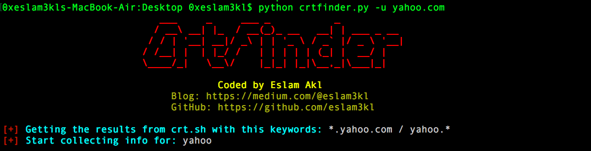
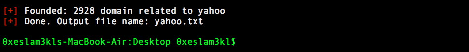

# crtfinder
Simple script tool to extract all subdomains from **crt.sh** website. Output will be up to *sub.sub.sub.subdomain.com*

### How to install 
` pip install -r requirments.txt`

### How to use it 
` python crtfinder.py -u domain.com `
 
 
### Examples 

#### Results will be in text file contain all output subdomains. 
It collects almost _2900_ subdomains for the domain `yahoo.com` only, you should take some of juicy subdomains and search for them also. 

Ex. `python crtfinder.py -u corp.yahoo.com`

It will get back to you some of interesting subdomains in addition to the original subdomains.

